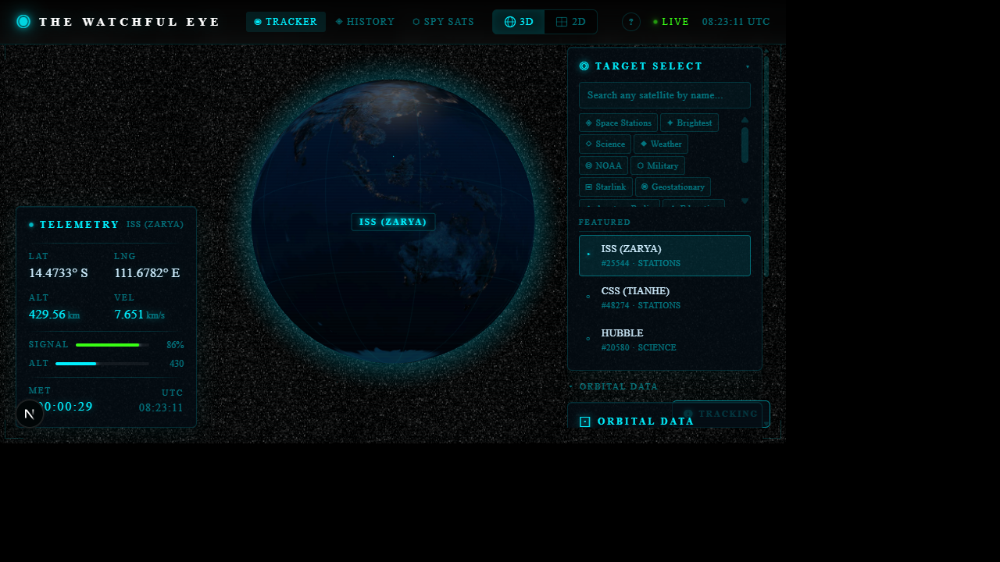
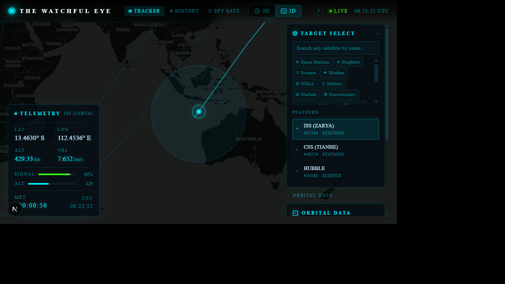
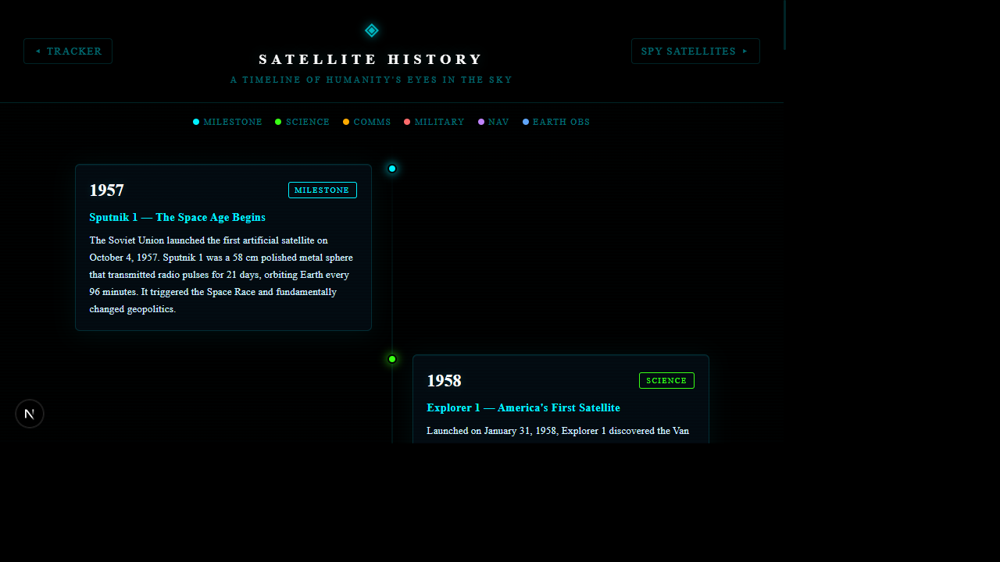
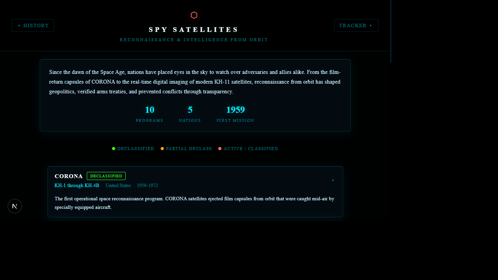

# The Watchful Eye

A real-time satellite tracking application with an interactive 3D globe, 2D map projection, and a comprehensive archive of satellite history and reconnaissance programs. Built with Next.js, Three.js, and satellite.js, the application pulls live orbital data from CelesTrak and propagates satellite positions in real time using the SGP4/SDP4 algorithm.

---

## Screenshots

### 3D Globe Dashboard



The primary tracking interface renders an interactive 3D globe with the selected satellite shown as a glowing animated marker. The current ground track (orbit path) is drawn across the globe surface, and a circular footprint ring indicates the satellite's line-of-sight coverage area. A floating label follows the satellite with its name and current altitude. The heads-up display on the left shows live telemetry: latitude, longitude, altitude, velocity, signal strength, mission elapsed time, and UTC clock.

### 2D Map View



An alternative flat-map projection powered by Leaflet and CartoDB dark tiles. The satellite's position is marked with a pulsing icon, and multiple future orbit passes are rendered as polylines wrapping across the map. A translucent footprint circle shows the satellite's current coverage area. Clicking the satellite marker opens a popup with its name, altitude, and velocity.

### Satellite History Timeline



An interactive vertical timeline chronicling 21 landmark events in satellite history, from the launch of Sputnik 1 in 1957 through the James Webb Space Telescope in 2021. Each entry includes the satellite name, launch year, country of origin, and a detailed description of its mission and significance. A parallax starfield background adds depth to the page.

### Spy Satellites Archive



A curated catalog of 10 reconnaissance and intelligence satellite programs spanning five nations. Each program card displays its operational designation, country, active years, classification status (declassified, partial declass, or active/classified), and a description of its capabilities and historical impact. Programs covered include CORONA, GAMBIT, HEXAGON, KH-11 KENNEN, Lacrosse/Onyx, Misty, Zenit, Yantar, Persona, and Ofek.

---

## Features

### Real-Time Satellite Tracking
- Live orbital propagation using the SGP4/SDP4 algorithm from satellite.js, updated at 10 Hz (100 ms intervals).
- Positions computed from Two-Line Element (TLE) sets fetched directly from the CelesTrak General Perturbations (GP) API.
- Full orbit path computation projecting future ground tracks across 360 degrees of travel.
- Footprint radius calculation based on satellite altitude, showing the instantaneous line-of-sight coverage circle.

### 3D Interactive Globe
- Rendered with react-globe.gl and Three.js on a high-resolution Earth texture with bump mapping for terrain relief.
- Night-side Earth texture showing city lights on the dark hemisphere.
- Latitude/longitude graticule grid rendered as subtle lines across the globe surface.
- Satellite rendered as a custom Three.js object: a glowing sphere with a pulsing outer ring and an animated point light.
- Floating HTML label above the satellite displaying its name and current altitude in kilometers.
- Click-to-inspect tooltip showing satellite name, altitude, velocity, latitude, longitude, and orbital period.
- Orbit path rendered as a colored line along the globe surface.
- Footprint ring rendered as a dashed translucent path on the globe.
- Auto-track camera that follows the satellite, with automatic pause when the user interacts with the globe (mouse drag, scroll, or touch). A toggle button allows switching auto-track on and off.
- Zoom constraints (minimum distance 110, maximum distance 800) preventing the camera from clipping into the globe or zooming too far out.
- Atmosphere glow effect on the globe edge.

### 2D Map Projection
- Leaflet map with CartoDB Dark Matter tile layer.
- Multiple orbit passes rendered as polylines, with wrap-around handling for orbits crossing the antimeridian.
- Satellite position shown as a custom Leaflet divIcon with a pulsing CSS animation.
- Footprint coverage rendered as a translucent circle overlay.
- Click popup on the satellite marker with telemetry details.
- Map auto-centers on the satellite position as it moves.

### Heads-Up Display (HUD)
- Live telemetry panel showing:
  - Geographic latitude and longitude in decimal degrees.
  - Altitude above sea level in kilometers.
  - Orbital velocity in km/s.
  - Simulated signal strength indicator.
  - Mission Elapsed Time (MET) counting up from page load.
  - Current UTC time.
- Styled as a mission-control terminal with monospace fonts and glowing borders.

### Satellite Selector
- Browse satellites across 17 categories sourced from CelesTrak:
  - Last 30 Days Launches, Space Stations, Active Geosynchronous, Starlink, OneWeb, Iridium, Globalstar, Amateur Radio, GPS Operational, GLONASS Operational, Galileo, BeiDou, Weather, NOAA, Earth Resources, Search and Rescue, and Tracking/Data Relay.
- Each category dynamically fetches its satellite catalog from CelesTrak with a 30-minute client-side cache to reduce API calls.
- Text search with debounce filtering across all loaded satellite names.
- Clean scrollable list with satellite names displayed in monospace terminal style.

### Orbital Information Panel
- Displays computed orbital parameters for the currently tracked satellite:
  - Inclination, Right Ascension of the Ascending Node (RAAN), eccentricity, argument of perigee, mean anomaly, mean motion, and revolution number.
- All values derived from the parsed TLE data.

### Loading Screen
- Animated boot sequence that plays on first visit, simulating a satellite tracking system initialization.
- Five-phase progress bar with status messages: system initialization, establishing uplink, loading TLE database, calibrating tracking systems, and going operational.
- Session-aware: only plays once per browser session (tracked via sessionStorage), skipped on subsequent page loads.

### Satellite History Timeline
- 21 curated historical entries spanning 1957 to 2021.
- Each entry includes: satellite name, year, country, and a multi-sentence description of the mission.
- Interactive vertical timeline layout with animated entry transitions.
- Parallax starfield background with layered scrolling.
- Navigation links to the main tracker and the spy satellites archive.

### Spy Satellites Archive
- 10 reconnaissance programs from 5 nations (United States, Russia, Israel).
- Classification status badges: Declassified (green), Partial Declass (amber), Active/Classified (red).
- Expandable program cards with operational designation, date range, and detailed capability descriptions.
- Summary statistics header showing total programs, nations, and earliest mission year.

### View Toggle
- Seamless switch between 3D Globe and 2D Map views via dedicated buttons in the interface header.
- View preference is remembered during the session.

---

## Tech Stack

| Layer | Technology | Purpose |
|-------|-----------|---------|
| Framework | Next.js 16.1.6 (App Router, Turbopack) | Server-side rendering, routing, bundling |
| Language | TypeScript 5 (strict mode) | Type safety across the entire codebase |
| UI Library | React 19.2.3 | Component architecture and state management |
| 3D Rendering | Three.js 0.183 + react-globe.gl 2.37 | Interactive 3D globe with custom objects |
| 2D Mapping | Leaflet 1.9 + react-leaflet 5.0 | Flat map projection with tile layers |
| Orbital Mechanics | satellite.js 6.0 | SGP4/SDP4 propagation from TLE data |
| Styling | Tailwind CSS 4 + custom CSS | Mission-control aesthetic with animations |
| Data Source | CelesTrak GP API | Live Two-Line Element sets for 17 categories |

---

## Project Structure

```
watchful-eye/
  src/
    app/
      layout.tsx            Root layout with metadata and font loading
      page.tsx              Main tracker page (renders Dashboard)
      globals.css           Full mission-control themed stylesheet
      history/
        page.tsx            Satellite history timeline
        spy/
          page.tsx          Spy satellites archive
    components/
      Dashboard.tsx         Main orchestrator: state, data fetching, propagation loop
      GlobeView.tsx         3D globe with satellite marker, orbit, footprint, tooltip
      MapView2D.tsx         2D Leaflet map with orbit tracks and coverage circle
      HUD.tsx               Live telemetry heads-up display
      SatelliteSelector.tsx Category browser and satellite search
      OrbitalInfo.tsx       Orbital parameters panel
      LoadingScreen.tsx     Animated boot sequence
      Navigation.tsx        Page navigation links
      ViewToggle.tsx        3D/2D view switch buttons
      Guide.tsx             Quick-start usage guide
    lib/
      orbital.ts            SGP4 propagation, orbit path, footprint calculation
      satellites.ts         CelesTrak API client with category definitions and caching
      satellite-history.ts  Historical timeline data and spy program entries
  public/
    earth-blue-marble.jpg   Daytime Earth texture
    earth-topology.png      Bump map for terrain relief
    earth-night.jpg         Night-side city lights texture
    earth-water.png         Water mask texture
    screenshots/            Application screenshots
```

---

## Architecture

### Data Flow

1. **Satellite Selection**: The user picks a category and satellite from the `SatelliteSelector`. The component fetches the TLE catalog for that category from CelesTrak via the `satellites.ts` API client, which caches responses for 30 minutes.

2. **TLE Parsing**: When a satellite is selected, `Dashboard.tsx` fetches the full TLE for that satellite (or uses the cached catalog entry). The TLE is parsed by satellite.js into a `satrec` object suitable for SGP4 propagation.

3. **Real-Time Propagation**: A `setInterval` loop in `Dashboard.tsx` runs every 100 ms. On each tick, it calls `propagateSatellite()` from `orbital.ts`, which invokes `satellite.propagate()` with the current date, converts the resulting ECI position/velocity to geodetic coordinates (latitude, longitude, altitude), and computes velocity magnitude.

4. **Orbit Computation**: Every 5 minutes (or on satellite change), `computeOrbitPath()` generates the full ground track by propagating the satellite forward through one complete revolution in 1-minute steps. The resulting array of [lat, lng, alt] points is passed to the active view component.

5. **Rendering**: The position, orbit path, and footprint radius are passed as props to either `GlobeView` (3D) or `MapView2D` (2D), which render them in their respective coordinate systems. The `HUD` and `OrbitalInfo` components receive the same data and display it as formatted telemetry.

### Orbital Mechanics

The application uses the SGP4 (Simplified General Perturbations 4) algorithm, which is the standard model for propagating Earth-orbiting satellites from NORAD Two-Line Element sets. SGP4 accounts for:

- Earth's oblateness (J2, J3, J4 zonal harmonics)
- Atmospheric drag (using the B* drag term from the TLE)
- Solar and lunar gravitational perturbations (for deep-space objects via SDP4)
- Secular and periodic variations in orbital elements

Positions are computed in the True Equator Mean Equinox (TEME) reference frame and then converted to geodetic coordinates (latitude, longitude, altitude above the WGS84 ellipsoid) using the `eciToGeodetic` function with Greenwich Mean Sidereal Time correction.

The footprint radius is computed geometrically as the Earth-central angle subtended by the satellite's horizon:

```
footprintRadius = arccos(R_earth / (R_earth + altitude)) * (180 / pi)
```

This gives the angular radius in degrees of the circle on Earth's surface within which the satellite is above the local horizon.

---

## Getting Started

### Prerequisites

- Node.js 18 or later
- npm, yarn, pnpm, or bun

### Installation

```bash
git clone https://github.com/Aakashnath645/the-watchful-eye.git
cd the-watchful-eye
npm install
```

### Development

```bash
npm run dev
```

Open [http://localhost:3000](http://localhost:3000) in your browser. The application will start with the animated loading sequence on first visit, then display the 3D globe tracking the International Space Station by default.

### Production Build

```bash
npm run build
npm start
```

---

## Data Sources

- **CelesTrak GP API** (https://celestrak.org/NORAD/elements/gp.php): Provides current Two-Line Element sets for thousands of cataloged objects, organized by category (stations, weather, navigation, communications, etc.). Data is sourced from the 18th Space Defense Squadron (18 SDS) catalog.
- **Earth Textures**: NASA Blue Marble imagery for daytime surface, NASA Earth at Night for city lights, and topology data for bump mapping.
- **Historical Data**: Satellite history timeline and spy satellite program descriptions are curated from publicly available declassified records and published aerospace history sources.

---

## License

This project is provided as-is for educational and personal use.
